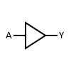
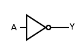
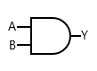
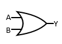
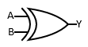
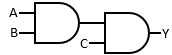

# Logic Gates

* Now that we know how to use binary representations, we will look at how to perform operations on them.

* *Logic gates* are simple digital circuits which take one or more bits and produce a binary output.
    * We can represent a logic gate graphically using a diagram, via a *truth table*, which lists the inputs and their corresponding outputs in tabular form which enumerates all possible inputs, or via a *Boolean formula*.

* **If anything below doesn't look quite right (in particular, the stuff with overlines), I'm not sure how to properly format them currently. They look fine locally, but something with how GitHub is rendering LaTeX seems to break certain formatting.**

## Buffer

* The simplest logic gate is the *buffer*.
    * Whichever bit you give it, it gives it back.
    * This may seem useless in the level of abstraction we're working in, but remember that we're modeling the more concrete setting of analog circuits, where buffers are used to amplify signals.
    * The triangle in the diagram represents the buffer.
        * We call the lines going in and out *wires*.
    * We represent the input by a capital $A$ and the output by $Y$.
    * The truth table for a buffer is quite simple:

    |  A   |  Y  |
    | :-:  | :-: |
    |  0   |  0  |
    |  1   |  1  |

    * The Boolean formula is just as simple, $Y = A$.

* We won't be working with buffers by themselves all that often, but it's good to know that we *can* work at the more concrete side of things when we need to.

## NOT Gate

* The *NOT gate* is the next-simplest gate.
    * Whichever bit you give it, it'll give you the other.
    * Because of this, it's also called an *inverter*.
    * Diagrammatically, we denote it by a buffer followed by a circle, called a *bubble*.
    * The truth table for a NOT gate:

    |  A   |  Y  |
    | :-:  | :-: |
    |  0   |  1  |
    |  1   |  0  |

    * There are multiple symbols used for the Boolean formula.
        * We will use $Y = A'$
        * Other symbols include:
            * $Y = \lnot A$
            * $Y = {\sim} A$
            * $Y = {!}A$
            * $Y = \overline{A}$

## AND Gate

* The *AND gate* is a two-input logic gate.
    * This means we take in **two** inputs, which we'll call $A$ and $B$.
    * We diagram it using a rectangular-like symbol with the output side circular.
    * The *AND* of two bits can be described using the following truth table:

    |  A   |  B  |  Y  |
    | :-:  | :-: | :-: |
    |  0   |  0  |  0  |
    |  0   |  1  |  0  |
    |  1   |  0  |  0  |
    |  1   |  1  |  1  |

    * Note that we now have four rows, because there are four different combinations of 0 and 1 with 2 bits.
        * In general, if we have a boolean formula which takes $N$ bits, there will need to be $2^{N}$ rows.
        * Indeed, this does get quite large very quickly, which is why we'll eventually introduce ways to analyze boolean formulas without needed tables.
    * Here, we only get a 1 as an output if both inputs are 1.
        * Think of this as requiring that both inputs $A$ **and** $B$ are true or enabled for the output to be true or enabled.
    * Like before, there are multiple symbols that are traditionally used.
        * We will use juxtaposition, like with multiplication (can you see the connection?), so $Y = AB$.
        * Other symbols include:
            * $Y = A \land B$
            * $`Y = A \& B`$
            * $Y = A \cdot B$

## OR Gate

* The *OR gate* is a two-input logic gate.
    * We diagram it using a triangular-like symbol with a circular dip inside on the input side and a rounded tip on the output side.
    * The *OR* of two bits can be described using the following truth table:

    |  A   |  B  |  Y  |
    | :-:  | :-: | :-: |
    |  0   |  0  |  0  |
    |  0   |  1  |  1  |
    |  1   |  0  |  1  |
    |  1   |  1  |  1  |

    * Here, the only 0 is when both are 0.
        * This doesn't map as smoothly to English where "or" is typically *exclusive*.
        * This is an *inclusive* or, meaning we allow both bits to be 1 to get a 1 for an output.
            * This is the usual "or" used in mathematics, and is the source of the somewhat tired joke of answering "yes" when asked if one wants "this or that."
    * Like before, there are multiple symbols that are traditionally used.
        * We will use the addition symbol, so $Y = A + B$.
        * Other symbols include:
            * $Y = A \lor B$
            * $Y = A | B$

## Exclusive OR (XOR) gate

* The *XOR gate* is a two-input logic gate.
    * We diagram it using essentially an OR gate, but with an arc in the inputs to denote that it's exclusive.
    * The *OR* of two bits can be described using the following truth table:

    |  A   |  B  |  Y  |
    | :-:  | :-: | :-: |
    |  0   |  0  |  0  |
    |  0   |  1  |  1  |
    |  1   |  0  |  1  |
    |  1   |  1  |  0  |

    * This lines up more with out intuitive, *exclusive* version of "or" in English.
    * There's actually only one symbol that's really used outside of programming, which is $Y = A \oplus B$.
        * In programming contexts, the *caret* symbol ^ is often used, though this looks too much like $\land$, so we'll disregard it here.
    * Unlike with the AND gate, the symbols used for OR and XOR are sort-of "incorrect" if we think about the arithmetic analogies they're trying to make (since XOR is literally 1-bit binary addition with intentional overflow).

## Other Two-Input Gates

* We have other gates, the *NAND*, *NOR*, and *XNOR* gates.
    * We diagram them using the usual diagrams but with the added bubble like with the NOT gate.
    * Symbolically, we combine the AND, OR, and XOR symbols with the overline from the NOT gate.
        * For example, NAND is $Y = \left(AB\right)'$.

* An interesting fact about boolean functions, in general, is that we can model them using just AND and NOT or OR and NOT gates.
    * This is beyond the scope of this course, so we'll just take it as a given.

* But, it turns out, we can do even better:

**Theorem.** Any boolean function can be represented using only NAND gates. The same result holds using only NOR gates, as well.

**Proof.**

To prove this, we need only use the interesting fact above and implement AND and NOT using NAND. The NOR case will be left as an exercise for the reader.

Here, we will provide the implementations, and verification can be done using truth tables. We will see another way to verify these expressions later, using DeMorgan's Laws.

* $A' = \left(AA\right)'$
    * In other words, the NAND of $A$ with itself gives a NOT gate.

* $AB = \left(\left(AB\right)' \cdot \left(AB\right)'\right)'$
    * In other words, the NAND of $A$ NAND $B$ with $A$ NAND $B$.
    * We explicitly use the $\cdot$ notation for AND here just to put a bit of space inside for legibility.

We'll only provide the truth table for the second expression, as the first one seems trivial.

|  $A$   |  $B$  |  $AB$  |  $\left(AB\right)'$  |  $\left(AB\right)'\cdot\left(AB\right)'$  | $\left(\left(AB\right)' \cdot \left(AB\right)'\right)'$  |
| :-:  | :-: | :-: | :-: | :-: | :-: |
|  0   |  0  |  0  |  1  |  1  |  0  |
|  0   |  1  |  0  |  1  |  1  |  0  |
|  1   |  0  |  0  |  1  |  1  |  0  |
|  1   |  1  |  1  |  0  |  0  |  1  |

Since the columns for $AB$ and $\left(\left(AB\right)' \cdot \left(AB\right)'\right)'$ match, they're the same.

**QED**

## Multiple-Input Gates

* Many boolean functions have more than two inputs.
    * In particular, we can allow for more than two inputs into any of the two-input gates above.

* An $N\rm{-input}$ AND is similar to a 2-input AND in that the only case where a 1 appears is if all bits are 1.

* Similarly, an $N\rm{-input}$ OR is 1 as long as at least one of the input bits is 1.

* We can diagram these as before, but with more wires.

* As mentioned in the previous section, any boolean function can be made with 2-input gates, and this is also true here.
    * An $N\rm{-input}$ AND can be built by using multiple layers of AND gates.
        * An example is seen below.

* The figure above works because AND gates satisfy the *associative* property.
    * In particular, $ABC = \left(AB\right)C$ is what we see in the diagram.

* More properties will be looked at in more detail in later notes.